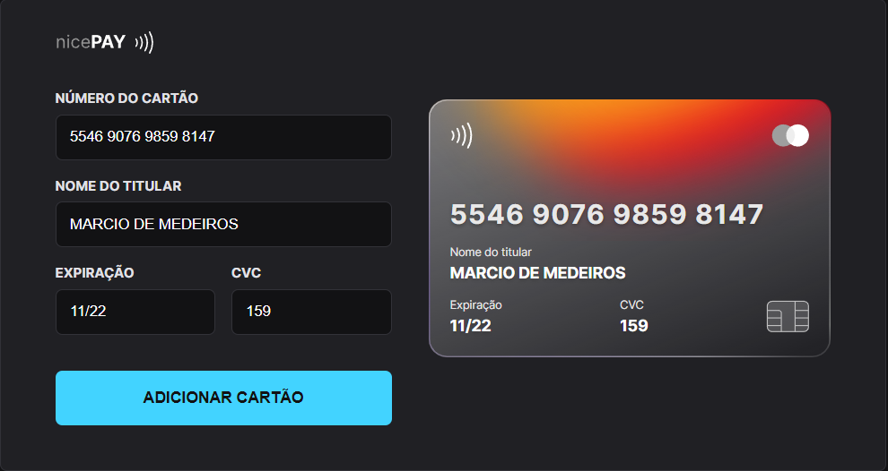
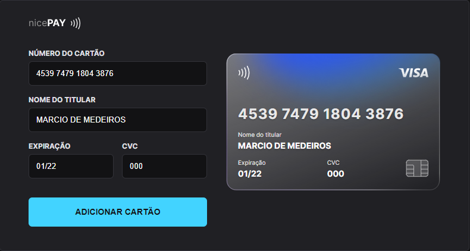
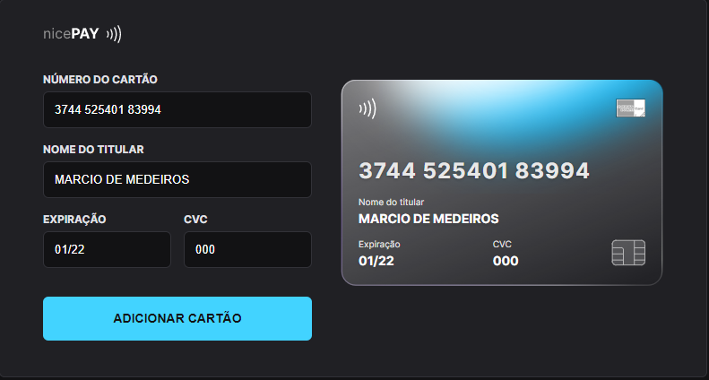

<h1 align="center"> nicePAY </h1>

Api desenvolvida para cadastramento de cartões

  <a href="#-tecnologias">Tecnologias</a>&nbsp;&nbsp;&nbsp;|&nbsp;&nbsp;&nbsp;
  <a href="#-projeto">Projeto</a>&nbsp;&nbsp;&nbsp;|&nbsp;&nbsp;&nbsp;
  <a href="#-layout">Layout</a>&nbsp;&nbsp;&nbsp;|&nbsp;&nbsp;&nbsp;
<a href = "https://nicepayapi-q85q2939t-gh0st2002.vercel.app/" target="_blank"> Visualizar Projeto ONLINE </a>

  

 

  

  

  

## 🚀 Tecnologias

Esse projeto foi desenvolvido com as seguintes tecnologias:

- HTML e CSS
- JavaScript e JSON
- [Node e NPM](https://nodejs.org/)
- [Vite](https://vitejs.dev/)
- [iMask](https://imask.js.org)

## 💻 Projeto

O nicePay é um componente que simula o formulário de preenchimento de cartão de crédito, onde é possível adicionar máscara aos inputs e atualizar elementos HTML via DOM.

Cartões suportados atualmente (20/10/2022): MasterCard, Amex, Visa.

## 🔖 Layout

Você pode visualizar o figma do projeto através [DESTE LINK](https://www.figma.com/file/6hRDNmdtTQlZdCj3Qvj24k/Explorer-Lab-%2301-(Copy)?node-id=0%3A1).
Você pode visualizar o projeto ONLINE através [DESTE LINK](https://nicepayapi-q85q2939t-gh0st2002.vercel.app/).

## :memo: Licença

Esse projeto está sob a licença MIT.

---
